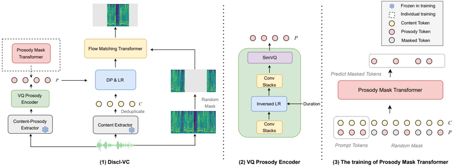

> [!abstract] Interspeech · 2025 · Conference
> **Wang et al.** · [→ Paper](https://www.isca-archive.org/interspeech_2025/wang25ba_interspeech.html) · Demo: ✓ · Code: ✗
>
> Discl-VC disentangles speech into content, prosody, and timbre through dedicated SSL-based extractors and discrete token spaces, then applies in-context learning via a flow matching transformer and a non-autoregressive prosody mask transformer to enable controllable zero-shot voice conversion.

## Problem

Zero-shot voice conversion converts a source speaker's voice to an unseen target speaker while preserving linguistic content. Most existing systems frame this as a two-factor problem, separating content from speaker identity, and neglect speaking style as an independently controllable axis. When prosody is entangled with content or timbre representations, systems either fail to preserve the source speaker's prosodic patterns or cannot reliably transfer a target speaker's distinctive speaking style. Achieving fine-grained, independently controllable prosody in a zero-shot setting requires explicit disentanglement of all three speech attributes (content, prosody, timbre) into separate representation spaces.

## Method

Discl-VC decomposes speech into three factors, each extracted by a dedicated module. Content is extracted by applying k-means clustering (1024 clusters) to HuBERT large representations from its 24th layer; adjacent duplicate tokens are then removed to strip duration-related prosody from the resulting discrete sequence. Prosody is extracted via a VQ Prosody Encoder that operates on ContentVec features, which already suppress speaker information. The encoder consists of two convolution stacks, an inversed length regulator (to compress the sequence to a prosody-rate representation), and a SimVQ bottleneck. SimVQ avoids codebook collapse by freezing randomly initialised codebook vectors and routing gradients through a learned linear projection rather than updating codes directly. An F0 supervision loss (using z-score normalised pitch to remove speaker-level variance) further constrains the encoder to capture pitch information accurately. A duration predictor and length regulator subsequently expand the content token sequence to the target frame rate.

Acoustic generation uses a flow matching transformer with optimal-transport conditional flow matching. The transformer (DiT blocks with adaLN-zero conditioning, 12 layers, 12 heads, embedding dim 768) takes content tokens, prosody tokens, and a masked mel spectrogram as inputs and predicts the unmasked regions, with surrounding context serving as in-context speaker information. Classifier-free guidance (drop probability 0.2) is applied to both conditioning inputs and the masked context. BigVGAN converts the predicted 80-dim mel spectrogram (16 kHz, hop size 320) to waveform.

For prosody conversion (mimicking a reference speaker's style), a non-autoregressive prosody mask transformer predicts prosody tokens for the generated speech conditioned on a reference audio's prosody prompt. It starts with fully masked prosody tokens and iteratively unmasks them over 16 steps using a cosine confidence schedule with Gumbel noise and top-k sampling (k=40, temperature annealed from 1.5 to 0). Training is two-stage: stage 1 jointly trains the VQ prosody encoder, duration predictor, and flow matching transformer on 6k hours of English speech from Librilight; stage 2 trains the prosody mask transformer on prosody tokens extracted by the frozen stage-1 encoder.

## Key Results

On zero-shot voice conversion (VCTK, 450 test pairs across 10 speakers), Discl-VC achieves N-MOS 4.31, UTMOS 4.079, WER 1.946%, and SECS 0.929 with 131M parameters. It surpasses both Vevo (4.26 MOS, 922M params) and FAcodec (3.44 MOS, 138M params) on naturalness and F0 correlation (0.973 vs 0.966 for Vevo), while matching Vevo's speaker similarity (0.929 vs 0.930). WER falls between the two baselines (FAcodec: 1.341%, Vevo: 2.705%), indicating a slight intelligibility trade-off relative to FAcodec's more conservative conversion. (Table 1)

On prosody preservation (ESD source, VCTK target, 1000 pairs), Discl-VC outperforms Vevo in speech quality (UTMOS 4.119 vs 4.057) and speaker similarity (SECS 0.839 vs 0.838) while matching FAcodec's F0 correlation (0.941 vs 0.942). On prosody conversion (VCTK source, ESD target), Discl-VC achieves better UTMOS (4.063 vs 3.783) and WER (4.139% vs 7.72%) than Vevo, though speaker similarity is lower (SECS 0.847 vs 0.892), reflecting a trade-off between cross-speaker prosody transfer and identity preservation. (Table 2)

Ablation on VCTK confirms that each component contributes: removing ContentVec (using mel spectrogram first 20 dimensions for prosody) causes the largest degradation (UTMOS 4.034, WER 3.147%), attributed to train-inference mismatch when source and target audio come from the same speaker during training. Replacing SimVQ with standard VQ degrades all metrics due to codebook collapse. Removing F0 loss improves WER slightly (1.279% vs 1.946%) but reduces prosody fidelity (F0 Corr 0.971 vs 0.973). (Table 3)

## Novelty Assessment

The primary contribution is the explicit three-way disentanglement architecture: using two distinct SSL models (HuBERT for content, ContentVec for prosody) and a SimVQ bottleneck to produce separate discrete token spaces for content and prosody is a specific design choice not found in prior VC work. The prosody mask transformer applies the established mask-and-predict paradigm (from MaskGIT, NaturalSpeech 3, MaskGCT) to discrete prosody token prediction, which is a direct adaptation of a TTS technique to controllable VC.

All individual building blocks are established: flow matching, SimVQ, mask-and-predict generation, HuBERT k-means discretisation, and ContentVec disentanglement each derive from prior work. The novelty lies in how they are assembled for the VC controllability problem. The evaluation uses a relatively small test set and compares against only two baselines (FAcodec, Vevo), so the empirical scope is limited. The 7x parameter efficiency relative to Vevo is a meaningful practical advantage.

## Field Significance

Moderate — Discl-VC provides a compact, practical design for controllable zero-shot VC that explicitly separates prosody from content using dedicated SSL extractors and discrete token spaces. The SimVQ bottleneck approach to prosody disentanglement and the two-stage training (flow matching then prosody mask transformer) can serve as a reference architecture for subsequent work on attribute-controllable VC. The paper demonstrates that competitive naturalness and speaker similarity are achievable at 131M parameters for standard VC and 269M for prosody-controllable VC.

## Claims

- **supports:** Explicit disentanglement of content and prosody into separate discrete token spaces via different SSL representations enables independent control of speaking style in zero-shot voice conversion.
  > *Evidence:* Using HuBERT (content) and ContentVec with SimVQ bottleneck (prosody) as separate extractors, with a prosody mask transformer for reference-guided style transfer, yields F0 Corr of 0.941 for prosody preservation and 0.822 for prosody conversion on ESD/VCTK, while ablations show that using a single mel-based prosody input significantly degrades performance. *(§2.1, §3.2, Table 2)*

- **supports:** Flow matching with in-context learning achieves competitive zero-shot voice conversion quality at substantially fewer parameters than larger autoregressive systems.
  > *Evidence:* Discl-VC (131M params) achieves MOS 4.31, UTMOS 4.079, and SECS 0.929 on VCTK zero-shot VC, surpassing Vevo (922M params) on naturalness and matching speaker similarity, demonstrating that compact flow matching transformers are competitive with large-scale AR systems for VC. *(§3.2, Table 1)*

- **complicates:** Prosody transfer from a reference speaker introduces a trade-off with target speaker identity preservation.
  > *Evidence:* In the prosody conversion task, Discl-VC achieves lower SECS (0.847) than Vevo (0.892) despite better UTMOS and WER, suggesting that explicitly replacing source prosody with reference tokens disrupts timbre modeling and degrades speaker similarity relative to a system where prosody and identity are more entangled. *(§3.2, Table 2)*

- **supports:** SimVQ (freezing codebook vectors and learning a linear projection) reduces codebook collapse in VQ-based speech discretisation.
  > *Evidence:* Ablation replacing SimVQ with standard VQ causes degradation across all metrics (UTMOS 4.042 vs 4.079, WER 2.182% vs 1.946%, F0 Corr 0.970 vs 0.973, SECS 0.928 vs 0.929), attributed to codebook collapse during training. *(§3.3, Table 3)*

- **complicates:** SSL-based prosody extraction for VC can retain speaker-correlated information when the same-speaker assumption holds during training, causing train-inference mismatch.
  > *Evidence:* Ablation without ContentVec (using mel spectrogram first 20 dimensions as prosody input) shows the largest performance drop (UTMOS 4.034, WER 3.147%), attributed to prosody tokens containing residual speaker information because source and target audio come from the same speaker during training, creating a mismatch with cross-speaker inference. *(§3.3, Table 3)*

## Limitations and Open Questions

Evaluation is limited to English and uses only two baselines (Vevo and FAcodec) on a relatively small test set (450 pairs for zero-shot VC). The prosody conversion task's lower speaker similarity suggests that the prosody mask transformer introduces identity leakage when reference prosody comes from a different speaker. The paper does not report results on multilingual speakers or noisy conditions, leaving generalisation untested. The two-stage training procedure adds complexity and requires the stage-1 encoder to be frozen before the prosody mask transformer can be trained.

## Wiki Connections

- [[voice-conversion|Voice Conversion]] — proposes a two-stage controllable VC system that explicitly disentangles content, prosody, and timbre for zero-shot conversion.
- [[flow-matching|Flow Matching]] — uses optimal-transport conditional flow matching as the core acoustic generation mechanism via an in-context learning transformer.
- [[disentanglement|Disentanglement]] — the paper's primary architectural contribution is separating speech into three distinct discrete token spaces (content, prosody, timbre) using different SSL models and a SimVQ bottleneck.
- [[prosody-control|Prosody Control]] — introduces a non-autoregressive prosody mask transformer that independently predicts and controls discrete prosody tokens from a reference audio prompt.
- [[self-supervised-speech|Self-Supervised Speech]] — uses HuBERT large and ContentVec as core feature extractors for content and prosody disentanglement respectively.
- [[2502.07243|Vevo]] (Controllable zero-shot voice imitation) — primary experimental baseline; Discl-VC matches or surpasses Vevo on most metrics at 7x fewer parameters.
- [[2409.00750|MaskGCT]] (Masked generative codec transformer) — the prosody mask transformer design is directly inspired by MaskGCT's mask-and-predict token generation paradigm.
- [[2403.03100|NaturalSpeech 3]] (Zero-shot TTS with factorised codec and diffusion) — cited for the mask-and-predict learning paradigm applied to discrete speech tokens.
- [[2025.acl-long.313|F5-TTS]] (Fairytaler TTS with flow matching) — cited for the DiT block with adaLN-zero structure used in both transformers.
- [[2206.04658|BigVGAN]] (Universal neural vocoder) — used as the vocoder to convert predicted mel spectrograms to waveform.
