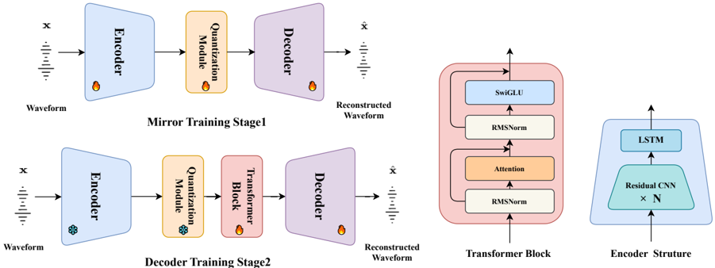

> [!abstract] Interspeech · 2025 · Conference
> **Chen et al.** · [→ Paper](https://www.isca-archive.org/interspeech_2025/chen25p_interspeech.html) · Demo: ✓ · Code: ?
>
> DS-Codec introduces a dual-stage training strategy that first trains a mirrored encoder-decoder codec to build robust codebooks, then freezes the encoder and quantizer and switches to a non-mirrored decoder augmented with a Transformer Block, achieving top single-codebook speech reconstruction on LibriSpeech.

## Problem

Conventional RVQ-based neural speech codecs produce multiple parallel token sequences, requiring an additional non-autoregressive stage when integrated with LLMs. Single-codebook codecs are therefore preferable for LLM-based TTS pipelines, but they face a structural tension: mirrored encoder-decoder architectures promote better quantization alignment and more robust codebooks, while non-mirrored architectures with stronger decoders produce higher reconstruction quality. Prior single-codebook work (BigCodec, WavTokenizer) picks one side of this trade-off. APCodec+, which introduced staged training for codecs, uses a non-mirrored structure throughout both stages, forgoing the codebook benefits of the mirrored design.

## Method

DS-Codec resolves the mirrored vs. non-mirrored trade-off by using each architecture in the stage where it is most beneficial, then switching between them during training.

The base architecture adopts a non-mirrored design: the encoder is a stack of residual CNN blocks with snake activation and a two-layer unidirectional LSTM, achieving a cumulative downsampling factor of 200 (80 tokens/second). The decoder uses transpose convolutions for upsampling. A Transformer Block, adapted from LLaMA's decoder layer with residual attention, SwiGLU, and RMSNorm, is inserted in the decoder path. Training uses two discriminators: the multi-period discriminator from HiFi-GAN and the multi-scale short-time Fourier transform discriminator from EnCodec.

Two quantization variants are offered. DS-Codec-VQ uses a single 8,192-code vector quantization codebook with L2-normalized embeddings projected through an 8-dimensional bottleneck (following DAC). DS-Codec-PQ uses product quantization with four VQ modules of codebook size 16, yielding 65,536 effective codes while maintaining the single-token interface required by LLMs.

Training proceeds in two stages. In Stage 1 (Mirror Training), the encoder, quantizer, and a mirrored decoder (symmetric to the encoder) are trained jointly. The mirror constraint forces the quantizer to learn representations that are well-aligned between input and output, reducing the MSE between quantization module input and output and building a robust codebook. In Stage 2 (Decoder Training), the encoder and quantizer are frozen, the decoder is switched to the non-mirrored architecture with the Transformer Block added, the discriminators are reinitialized, and training continues at a reduced learning rate. Crucially, decoder weights from Stage 1 are retained rather than reinitialized (unlike APCodec+), which accelerates Stage 2 convergence by starting from an already functional reconstruction baseline.

## Key Results

On LibriSpeech test-clean (2620 utterances), DS-Codec-VQ achieves UTMOS 4.218, PESQ 2.862, STOI 0.941, and F1 0.944 at 1.04kbps with 80 tokens/second, a single codebook. DS-Codec-PQ reaches UTMOS 4.214 and PESQ 2.882 at 1.28kbps. Both variants outperform all single-codebook baselines: BigCodec (the closest competitor at the same bitrate) scores UTMOS 4.108 and PESQ 2.681; WavTokenizer reaches UTMOS 3.784 and PESQ 2.114. Multi-codebook systems at 4 kbps or higher (DAC, EnCodec) are also surpassed on UTMOS by DS-Codec-VQ (Table 1).

On LJSpeech (2000 utterances), DS-Codec-VQ achieves UTMOS 4.451 and PESQ 2.962, both exceeding ground truth UTMOS (4.378), demonstrating cross-domain generalization beyond the LibriSpeech training distribution (Table 2).

Ablations confirm the contribution of each stage and component. The proposed mirror Stage 1 outperforms APCodec+'s non-mirrored Stage 1 (UTMOS 4.123 vs. 4.113, PESQ 2.768 vs. 2.632). Adding the Transformer Block in Stage 2 yields a further improvement over the Stage 2 variant without it (UTMOS 4.214 vs. 4.195, Table 3). Loss curve analysis shows that the mirrored structure consistently achieves lower quantization MSE than the non-mirrored structure during Stage 1, providing direct evidence that the mirror constraint improves codebook fidelity (§3.5, Figure 2).

## Novelty Assessment

The primary contribution is the dual-stage training strategy with architecture switching: training the encoder and quantizer under a mirrored constraint to build robust codebooks, then fine-tuning the decoder under a non-mirrored non-constraint with an added Transformer Block. This is a genuine training-procedure novelty; the individual architectural components (CNN encoder, VQ/PQ, Transformer Block, GAN discriminators) are all drawn from prior work (BigCodec, DAC, LLaMA, HiFi-GAN). The key distinction from APCodec+, the closest prior staged-training codec, is using a different architecture in each stage rather than the same one throughout. Retaining decoder weights between stages rather than reinitializing them is a practical improvement with measurable effect on convergence speed. The evaluation is conducted on standard benchmarks with publicly available baselines, and the ablation cleanly isolates the contribution of each stage and the Transformer Block. The model size is not reported, which limits direct parameter-efficiency comparisons.

## Field Significance

Moderate — DS-Codec demonstrates that a staged training strategy exploiting mirrored architecture in Stage 1 provides a measurable advantage for single-codebook codec quality, outperforming the concurrent BigCodec baseline on all reported metrics at the same bitrate. The approach is relevant to the growing class of LLM-based TTS systems that require single-token-per-frame codec representations, and introduces a clear design principle (use mirror symmetry to strengthen the quantizer, then specialize the decoder) that can inform future codec development.

## Claims

- **supports:** Staged codec training that separates quantizer optimization from decoder optimization can improve single-codebook reconstruction quality beyond joint training.
  > *Evidence:* DS-Codec's two-stage framework (mirror Stage 1 to train the quantizer, non-mirror Stage 2 to specialize the decoder) outperforms APCodec+'s single-stage joint training at both stages: Stage 1 UTMOS 4.123 vs. 4.113, PESQ 2.768 vs. 2.632; final model UTMOS 4.214 vs. 4.186 on LibriSpeech. *(§3.6, Table 3)*

- **supports:** A mirrored encoder-decoder constraint during quantizer training reduces the input-output MSE of the quantization module, producing more robust codebooks.
  > *Evidence:* VQ loss curves during Stage 1 show the mirrored structure achieves lower quantization MSE than the non-mirrored structure across training epochs, even though the non-mirrored structure has lower VQ loss; the paper interprets smaller MSE as higher codebook fidelity. *(§3.5, Figure 2)*

- **supports:** Product quantization over multiple small sub-codebooks enables large effective codebook sizes while preserving the single-token-per-frame interface required by LLM-based TTS.
  > *Evidence:* DS-Codec-PQ combines four 16-code VQ modules to produce a 65,536-code effective codebook, indexed as a single integer, achieving UTMOS 4.214 and PESQ 2.882 at 1.28kbps with 80 tokens/second. *(§2.2.2, Table 1)*

- **complicates:** A stronger decoder does not straightforwardly compensate for a weaker quantizer when both are trained jointly.
  > *Evidence:* APCodec+'s joint training with a non-mirrored (stronger) decoder in Stage 1 yields lower Stage 1 PESQ (2.632) than DS-Codec's mirror Stage 1 with a weaker mirrored decoder (PESQ 2.768), suggesting quantizer quality dominates reconstruction fidelity early in training. *(§3.6, Table 3)*

## Limitations and Open Questions

Evaluation is limited to English read speech (LibriSpeech) and one supplementary in-domain set (LJSpeech). Performance on noisy, spontaneous, or multilingual speech is untested. Model size is not reported, making it impossible to assess parameter efficiency relative to BigCodec (159M) or DAC (74M). The UTMOS and PESQ metrics used are objective proxies for perceptual quality; no formal subjective listening study is reported.

The Stage 2 improvement from retaining decoder weights vs. reinitializing them is stated but not ablated directly — the comparison to APCodec+ involves multiple differences (stage design, weight retention, architecture), so the isolated effect of weight retention is unclear.

## Wiki Connections

- [[neural-codec|Neural Audio Codec]] — DS-Codec directly advances single-codebook neural codec design, introducing dual-stage training to overcome the mirrored vs. non-mirrored architecture trade-off.
- [[autoregressive-codec-tts|Autoregressive Codec TTS]] — DS-Codec is explicitly motivated by the need for single-token-per-frame codecs compatible with LLM-based TTS pipelines.
- [[evaluation-metrics|Evaluation Metrics]] — the paper evaluates codec reconstruction quality using UTMOS, PESQ, STOI, and voiced/unvoiced F1 score, following the Vocos evaluation methodology.
- [[gan-vocoder|GAN Vocoder]] — DS-Codec uses multi-period and MS-STFT discriminators from HiFi-GAN and EnCodec, applying GAN training to codec reconstruction in both stages.
- [[2301.02111|VALL-E]] — cited as the motivating example of neural codec language models for TTS, establishing the requirement for discrete speech tokens compatible with autoregressive LM inference.
