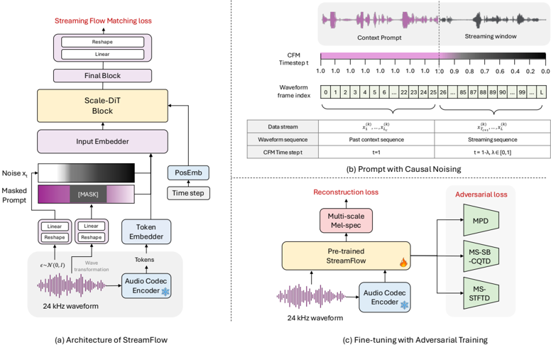
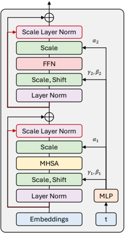

> [!abstract] NeurIPS · 2025 · Conference
> **Choi & Lee** (KT Corp. / Ajou University) · [→ Paper](https://openreview.net/forum?id=1cURNMriee) · Demo: ✓ · Code: ?
>
> Introduces streaming flow matching, a causal reformulation of conditional flow matching that jointly estimates multiple time-indexed vector fields to reconstruct high-fidelity audio from discrete codec tokens in real time, and demonstrates it as a drop-in replacement for Mimi's decoder inside Moshi's full-duplex speech pipeline.

## Problem

Conditional flow matching (CFM) has become a strong generative approach for audio, but existing CFM-based models generate entire sequences at once through multiple iterative sampling steps over a fixed target space, which is fundamentally incompatible with real-time or streaming generation. Meanwhile, real-time full-duplex speech systems (e.g., GPT-4o-style speech LMs) rely on causal convolutional codec decoders for low-latency waveform generation, but these causal decoders underperform their non-causal counterparts in perceptual quality, especially when decoding from highly compressed, low-bitrate discrete tokens, because they lack intermediate temporal modeling and progressive refinement. No prior work had explored streaming audio generation from discrete tokens within a diffusion or flow-matching framework.

## Method

The paper introduces Streaming Flow Matching (SFM), which partitions an input sequence into overlapping data streams, each combining a fixed-timestep context-prompt segment with a streaming segment whose timestep decreases linearly. A causal noising scheme masks only the streaming window while keeping the context prompt intact, preventing future-information leakage, and the model is trained to jointly predict velocity fields across multiple time axes at once rather than one global field per full sequence. At inference, previously generated frames are prepended as in-context prompts for subsequent streaming windows, and a causal shift operation integrates newly generated frames while preserving historical context.

To improve robustness in the underlying Diffusion Transformer, the paper introduces Scale-DiT: rather than adding a raw self-attention or feed-forward output directly to the residual stream (as in vanilla DiT), Scale-DiT computes the layer-normalized difference between the block's output and its input, then scales this difference by a learnable, bounded adaptive rate before adding it back to the residual, for both the attention and feed-forward sublayers. For waveform reconstruction from low-resolution token features, the model uses a linear-reshape transformation (from WaveNeXt) rather than STFT/iSTFT, since STFT-based approaches require a receptive field larger than the token hop size and thus need future context unsuitable for streaming. Training proceeds in two stages: SFM pretraining with the flow-matching objective, followed by adversarial fine-tuning using HiFi-GAN's multi-period discriminator, EnCodec's multi-scale STFT discriminator, and a multi-scale sub-band CQT discriminator, plus BigVGAN-v2's multi-scale STFT losses. The resulting StreamFlow model is trained and evaluated as a decoder for both EnCodec and Mimi discrete tokens, and separately integrated into Moshi's full-duplex speech pipeline by replacing its native Mimi decoder.

## Key Results

On EnCodec token reconstruction over a 300-sample universal speech test set, the non-streaming StreamFlow variant (170M params) outperforms strong parallel baselines (Vocos, Multi-Band Diffusion, RFWave) on M-STFT, PESQ, and UTMOS, and its streaming variants (11M-175M params) all outperform the streaming causal EnCodec baseline across every reported objective and subjective metric. On Mimi token reconstruction, StreamFlow outperforms Mimi's own decoder on WER, M-STFT, PESQ, pitch error, and UTMOS at matched bitrates (4/6/8 RVQ codebooks), and receives a positive comparative MOS preference from listeners (e.g., +0.085 CMOS at the 1100bps setting), though at roughly double the inference latency (160ms vs. 80ms) and higher memory use. Ablations show that removing adversarial fine-tuning, SFM pretraining, Scale-DiT, or RoPE positional embeddings each substantially degrade quality, with SFM pretraining being load-bearing: without it, adversarial training alone fails to produce working streaming generation and suffers discriminator collapse. Scale-DiT combined with REPA-style distillation from a Wav2Vec 2.0 teacher gives further gains over Scale-DiT alone at every training-step checkpoint tested (150k-700k steps).

## Novelty Assessment

The core contribution, reformulating conditional flow matching to jointly predict multiple time-indexed vector fields under causal noising for genuinely streaming, token-wise generation, is a real methodological extension not previously demonstrated for audio or, per the paper's survey of related work, for diffusion/flow-based generation more broadly. Scale-DiT's adaptively-scaled residual-difference mechanism is a smaller but concretely validated architectural change (ablated against vanilla DiT at matched parameter count). The demonstrated integration into Moshi's production full-duplex pipeline, replacing an existing shipped codec decoder rather than only comparing against it offline, is a meaningful real-system validation beyond a typical academic ablation study.

## Field Significance

> [!tip] high — Closes a specific, previously unaddressed gap (real-time streaming generation within flow-matching/diffusion frameworks) with a mechanism, streaming flow matching, that is not audio-specific and could plausibly generalize to other sequential streaming-generation domains.

As the paper itself notes, the underlying mechanism could extend to video and other time-series signals beyond audio. Combined with concrete, favorable quality/latency trade-offs against both parallel non-streaming and causal-convolutional streaming baselines, and validated integration as a drop-in decoder replacement inside an existing full-duplex speech LM (Moshi), this represents a substantive advance for streaming and real-time speech generation architectures rather than an incremental result.

## Claims

- **supports:** A causal, streaming reformulation of conditional flow matching that jointly estimates multiple time-indexed vector fields per stream can match or exceed the quality of full-sequence, non-streaming flow-matching and GAN-based waveform generation baselines while operating under real-time streaming constraints.
  > *Evidence:* The non-streaming StreamFlow variant outperforms parallel baselines (Vocos, Multi-Band Diffusion, RFWave) on M-STFT, PESQ, and UTMOS for EnCodec token reconstruction, and streaming StreamFlow variants outperform the streaming causal EnCodec baseline across all reported metrics. *(§4.2, Table 1)*
- **supports:** Regularizing a Diffusion Transformer's residual updates by normalizing and adaptively scaling the difference between a block's output and input, before the skip connection, can stabilize training and improve quality on high-resolution audio targets without increasing parameter count.
  > *Evidence:* Replacing Scale-DiT with a vanilla DiT of the same parameter count degrades PESQ from 3.430 to 2.557 and UTMOS from 3.792 to 3.033 on streaming Mimi-token reconstruction, and separately improves WER from 9.59 to 6.23 at matched training steps before adversarial fine-tuning. *(§4.3, §4.4, Tables 2 and 4)*
- **supports:** A learned flow-matching decoder trained for token reconstruction can outperform a neural codec's own purpose-built causal convolutional decoder on both objective quality and human comparative preference, while remaining practical to substitute into an existing real-time speech-LM pipeline.
  > *Evidence:* StreamFlow outperforms the native Mimi decoder on WER, M-STFT, PESQ, pitch error, and UTMOS at matched bitrates, receives a positive CMOS preference from listeners, and was integrated as a drop-in replacement for the Mimi decoder in Moshi's full-duplex pipeline. *(§4.5, Tables 5-6, Appendix H)*
- **complicates:** Streaming flow-matching pretraining alone is not sufficient to reach full generation quality; a subsequent adversarial fine-tuning stage remains necessary, adding training cost and complexity beyond the core flow-matching objective.
  > *Evidence:* Ablating adversarial fine-tuning drops PESQ from 3.430 to 2.669 and UTMOS from 3.792 to 3.178, and without prior flow-matching pretraining, adversarial training alone fails to produce working streaming generation, resulting in discriminator collapse. *(§4.3, Table 2)*

## Limitations and Open Questions

The authors note a direct quality/latency trade-off: increasing the number of sampling steps further improves quality, but the paper focuses on minimizing steps for real-time use, leaving the higher-quality, higher-latency end of that trade-off curve less explored. The two-stage training pipeline (SFM pretraining followed by adversarial fine-tuning with multiple discriminators) remains comparatively slow to train despite the fine-tuning stage itself being short, since discriminator-based fine-tuning is inherently costly. Streaming variants also carry a real latency and memory cost relative to Mimi's much smaller native decoder (175M vs. 79M parameters, 160ms vs. 80ms latency), a trade-off the paper reports but does not fully resolve.

## Wiki Connections

- [[flow-matching|Flow Matching]] — introduces streaming flow matching, a causal reformulation of conditional flow matching that jointly estimates multiple time-indexed vector fields to support real-time, token-wise streaming generation.
- [[streaming-tts|Streaming TTS]] — targets real-time, low-latency audio generation from discrete tokens and demonstrates integration into a full-duplex streaming speech pipeline (Moshi).
- [[neural-codec|Neural Audio Codec]] — trains a decoder for both EnCodec and Mimi discrete token streams and directly outperforms Mimi's own native decoder on reconstruction quality.
- [[gan-vocoder|GAN Vocoder]] — fine-tunes the flow-matching model with adversarial training using multi-period, multi-scale STFT, and multi-scale sub-band CQT discriminators for high-fidelity output.
- [[subjective-evaluation|Subjective Evaluation]] — reports human mean-opinion-score and comparative MOS ratings alongside objective reconstruction metrics.
