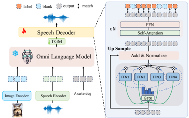

> [!abstract] NeurIPS · 2025 · Conference
> **Luo et al.** (Shenzhen Institute of Advanced Technology, CAS / Alibaba Tongyi Lab) · [→ Paper](https://openreview.net/forum?id=4iehXI36QG) · Demo: ? · Code: ✓
>
> An open-source omnimodal LLM that aligns vision, language, and speech through a text-pivoted, tri-modal-data-free training strategy, and generates real-time, self-aware emotional speech via a lightweight CTC-based streaming decoder trained with direct preference optimization.

## Problem

Open-source omnimodal LLMs (vision + language + speech in one system) lag proprietary models like GPT-4o on three fronts. First, training a fully end-to-end tri-modal system conventionally requires paired image-speech-text triples, which are scarce and expensive, pushing most open models toward true tri-modal corpora that under-use abundant pairwise (image-text or speech-text) data. Second, most models generate speech via a separate, external TTS module or autoregressive decoding, both of which add latency that is incompatible with real-time interaction. Third, existing open omnimodal systems produce flat, emotionally inconsistent speech that does not adapt tone or prosody to conversational context, since they lack a mechanism to align generation with emotional preference rather than only content correctness.

## Method

OpenOmni decomposes omnimodal alignment into two consecutive pairwise stages rather than one tri-modal stage: speech-text alignment (training a speech-augmented LLM on text-speech pairs so speech and text hidden representations become close) followed by image-text alignment (training on image-text pairs, with the LLM backbone frozen during pretraining to preserve general capabilities). Because the LLM comes to treat semantically similar text and spoken instructions similarly, the model exhibits quasi-zero-shot transfer: after image-text instruction tuning alone, it can already respond to a spoken instruction paired with an image, without ever seeing image-speech pairs directly.

For speech output, a lightweight streaming speech decoder, a mixture-of-experts layer plus a small decoder-only language model (initialized from Qwen2.5-0.5B-Instruct), sits after the main LLM and converts its hidden states into a discrete speech-unit sequence, decoded to waveform by a separate unit-based vocoder. The decoder supports both autoregressive and non-autoregressive decoding; the non-autoregressive mode is trained with a connectionist temporal classification (CTC) loss so unit sequences of unknown alignment can be predicted in parallel, and the MoE layer is reported as necessary for the decoder to train at all. On top of this, the paper introduces CTC-DPO: a direct preference optimization variant applied to the CTC-based speech decoder, trained on preference pairs built from an emotion-labeled multi-turn dialogue dataset (Plutchik's nine-emotion model), where the preferred response is emotionally congruent speech and the dispreferred response is emotionally neutral speech for the same context. This lets the model produce emotionally coherent speech directly, without a separate emotion-control module or handcrafted prompt.

## Key Results

On OmniBench, a benchmark requiring joint image-audio-text reasoning, OpenOmni (7B) scores 37.40 overall, beating the leading fully open-source omnimodal LLM VITA (7x8B, trained on true tri-modal data) at 33.45, despite a smaller model and fewer training samples, evidence that the pairwise-alignment strategy can substitute for tri-modal supervision. On vision-language benchmarks it is competitive with or ahead of comparable fully open-source models. For speech, non-autoregressive decoding generates up to 30 seconds of audio in under 1 second of latency, roughly 5x faster than autoregressive decoding. On speech-to-text and text-to-speech WER/CER benchmarks (LibriSpeech, AIShell-2), OpenOmni's own synthesized-speech recognition scores (e.g., 2.6% WER on LibriSpeech test-clean, 7.3-13.1% CER on AIShell-2) generally exceed prior omnimodal baselines (VITA, EMOVA) but still trail its own speech-recognition-only numbers on the same splits. On the bilingual EO2S-9K emotional-speech test set, CTC-DPO raises overall emotion-classification accuracy on generated speech from 62.6% to 65.4% (English) and 57.9% to 70.4% (Chinese) relative to the model without preference optimization.

## Novelty Assessment

The individual pieces, LLM-based omnimodal alignment, CTC-based non-autoregressive decoding, and DPO, are all established techniques; the paper's contribution is combining them into a specific pipeline: using text as a pivot to avoid tri-modal data, and adapting DPO to operate over a CTC-based speech decoder's discrete unit predictions for emotion control (CTC-DPO) rather than relying on an external emotion-conditioning module. The zero-shot cross-modal transfer observation (image-text instruction tuning alone enabling passable response to spoken instructions) is a genuine and useful empirical finding about how alignment generalizes, though it is explicitly reported as producing mostly text-dominant responses rather than fully robust speech understanding.

## Field Significance

moderate — Speech generation is one of three co-equal pillars in this paper (alongside vision-language and omnimodal reasoning) rather than the central focus, so its speech-specific contributions, the CTC-DPO mechanism for emotionally coherent generation and the low-latency non-autoregressive streaming decoder, are real but evaluated somewhat narrowly (bilingual WER/CER and one emotion-classification test set) relative to the paper's broader omnimodal claims. Within its speech scope, the demonstrated 5x latency reduction over autoregressive decoding and the open-source release are concretely useful contributions for real-time spoken interaction systems.

## Claims

- **supports:** A speech decoder trained with CTC-based non-autoregressive alignment on top of an LLM's hidden states can achieve large real-time latency reductions over autoregressive speech decoding, without requiring a separate external TTS module.
  > *Evidence:* The non-autoregressive speech decoder generates up to 30 seconds of speech in under 1 second of latency, roughly 5x faster than autoregressive decoding, replacing the common pattern of coupling an LLM to an external TTS system. *(§3.4, §4.2)*
- **supports:** Adapting direct preference optimization to a CTC-based non-autoregressive speech generation objective can induce emotionally coherent, context-aware speech without any explicit emotion-control module or handcrafted prompt at inference time.
  > *Evidence:* CTC-DPO training on emotion-congruent vs. emotion-neutral preference pairs raises overall emotion-classification accuracy on generated speech from 62.6% to 65.4% (English) and 57.9% to 70.4% (Chinese) on the bilingual EO2S-9K test set, with no additional inference-time control module. *(§4.2, Table 4)*
- **supports:** Progressive alignment through a shared text pivot, training separately on speech-text pairs and image-text pairs, can substitute for costly tri-modal (image-speech-text) training data while remaining competitive on omnimodal benchmarks.
  > *Evidence:* Trained only on pairwise speech-text and image-text data, OpenOmni outperforms VITA (trained on true tri-modal image-speech-text triples) on OmniBench, 37.40 vs. 33.45 overall, using a smaller model (7B vs. 7x8B) and fewer training samples. *(§4.2, Table 1)*
- **complicates:** Combining vision, language, and speech generation in one omnimodal system does not close the accuracy gap between a model's own synthesized-speech recognition and its recognition of natural speech input.
  > *Evidence:* On AIShell-2, OpenOmni's speech-to-text CER (6.8-6.9%) is lower than its text-to-speech CER on its own synthesized output (7.3-13.1%), and its synthesized-speech WER on LibriSpeech test-other (5.6%) exceeds its own speech-recognition WER on the same split (4.1%). *(§4.2, Table 3)*

## Limitations and Open Questions

The quasi-zero-shot transfer from image-text instruction tuning to spoken-instruction response is explicitly reported as producing predominantly text-dominant answers rather than robust omnimodal understanding, an approximation the authors attribute to representational similarity between text and speech instructions in the LLM rather than genuine trained speech-instruction understanding. Emotion-classification evaluation relies on an automated classifier (Emotion2Vec) rather than human listening tests, and the emotional preference dataset itself is partly synthetically constructed and augmented (via GPT-4o-mini) to balance underrepresented emotion categories, which may not fully reflect natural emotional speech distributions.

## Wiki Connections

- [[emotion-synthesis|Emotion Synthesis]] — trains a CTC-DPO objective on emotion-congruent vs. emotion-neutral speech preference pairs to produce self-aware emotional speech without an explicit control module.
- [[rlhf-speech|RLHF Speech]] — adapts direct preference optimization to a CTC-based non-autoregressive speech decoder's discrete unit predictions.
- [[streaming-tts|Streaming TTS]] — introduces a lightweight non-autoregressive streaming speech decoder achieving under 1 second latency, roughly 5x faster than autoregressive decoding.
- [[spoken-language-model|Spoken Language Model]] — trains an LLM to consume real external speech input (WeNetSpeech, LibriSpeech, AIShell-4) for speech-text alignment and multimodal dialogue.
- [[multilingual-tts|Multilingual TTS]] — trains and evaluates speech generation on bilingual Chinese/English data with per-language WER and CER results.
- [[2407.05407|CosyVoice]] — used as the TTS tool to synthesize the bilingual O2S-300K speech-generation training data and the emotion-conditioned preference pairs in EO2S-9K.
