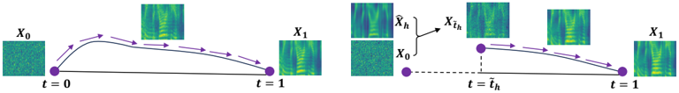

> [!abstract] NeurIPS · 2025 · Conference
> **Yang et al.** (The University of Tokyo / Nanyang Technological University) · [→ Paper](https://openreview.net/forum?id=SoRe80Tg48) · Demo: ✓ · Code: ✓
>
> Introduces Shallow Flow Matching (SFM), a mechanism for coarse-to-fine flow-matching TTS that starts sampling from an intermediate state constructed from a weak generator's coarse output, rather than from pure noise, improving naturalness and accelerating inference with adaptive-step ODE solvers.

## Problem

Many diffusion- or flow-matching-based TTS models use a coarse-to-fine pipeline: a weak generator produces coarse mel-spectrogram representations from text, which a flow-matching (FM) module then refines into high-quality mel-spectrograms. In conventional FM-based TTS, the coarse representations are used only as conditions, but the FM sampling process still starts from pure Gaussian noise. Since the coarse representations already encode a substantial share of the target's semantic and acoustic structure, modeling the early part of the flow from scratch is redundant computation that contributes little to final quality, an issue DiffSinger previously addressed for diffusion models with a "shallow diffusion" mechanism, but which had not been extended to flow matching.

## Method

The paper extends the shallow-generation idea to flow matching via two theoretical contributions (proved in the appendix) and a practical training/inference recipe. Theorem 1 shows that a random variable centered on a scaled target with some estimated variance can be mapped, via a scaling transformation, onto the conditional optimal-transport (CondOT) flow path used in standard FM. Theorem 2 shows that any intermediate point on a CondOT path can be used to split the path into two segments, each describable by its own piecewise flow and vector field, meaning inference and training can legitimately proceed using only the second (later) segment.

Building on these results, a lightweight SFM head is attached to a backbone TTS model's weak generator. It takes the generator's final hidden states and predicts a scaled coarse mel-spectrogram along with two scalars: an estimated time and variance locating that output on the CondOT path. During training, an orthogonal projection of the SFM head's output onto the ground-truth mel-spectrogram adaptively determines this time (rather than fixing it as a hyperparameter), and the resulting position is used, via Theorem 1, to construct a genuine intermediate state on the CondOT path; the model then trains only on the CFM loss for the path segment beyond that point (Theorem 2), alongside auxiliary losses supervising the coarse output, the estimated time, and the estimated variance. At inference, sampling starts directly from this constructed intermediate state instead of pure noise, and a tunable "SFM strength" hyperparameter (found via validation-set search) scales up the estimated time to compensate for the tendency of the training-time estimate to be small, strengthening the guidance the coarse representation provides.

## Key Results

SFM was validated by integrating it into four fully open-source TTS backbones spanning both U-Net-based (Matcha-TTS, CosyVoice) and DiT-based (StableTTS, CosyVoice-DiT) flow architectures, and both non-AR encoder-based and AR-LLM-based weak generators. Across all four, models trained with SFM consistently outperform matched baseline and ablated (coarse-loss-only, no shallow-start) versions on pseudo-MOS metrics (UTMOS, UTMOSv2, Distill-MOS) and on real subjective comparative naturalness (CMOS) and similarity (SMOS) ratings from 20 native-English Prolific listeners; WER and speaker-similarity gains are present but more variable across backbones. With adaptive-step ODE solvers, increasing SFM strength progressively and substantially reduces inference time, for example, real-time factor with the Bosh(3) solver drops by up to roughly 59% relative to the ablated model, because starting from a higher-signal intermediate state stabilizes the ODE solving process and lets the solver take fewer, larger steps; this acceleration does not apply to fixed-step solvers, which always run a predetermined number of steps regardless of trajectory difficulty.

## Novelty Assessment

The paper explicitly and correctly frames itself as extending DiffSinger's shallow diffusion mechanism from diffusion models to flow matching, a nontrivial extension since flow matching's deterministic ODE-based sampling and CondOT path structure differ meaningfully from diffusion's stochastic denoising process. The two supporting theorems (mapping an off-path estimate onto a valid CondOT path, and splitting that path into an independently-trainable later segment) are the genuine theoretical contribution enabling this extension; the orthogonal-projection mechanism for adaptively locating the starting time during training, rather than fixing it as a hyperparameter, is a concrete and practically important design choice validated by the SFM strength ablation. Related concurrent ideas (PeRFlow's piecewise reflow, shortcut models' self-consistency shortcuts, "Modifying Flow Matching"'s coarse-centered Gaussian sampling) pursue similar goals with different mechanisms, which the paper acknowledges directly.

## Field Significance

high — SFM is validated broadly (four architecturally diverse real TTS backbones, both objective and real subjective human evaluation, and explicit ablation against multiple plausible variants of the idea) and demonstrates two independently useful benefits, consistent naturalness improvement and substantial inference acceleration under adaptive-step solvers, from a lightweight, backbone-agnostic addition. The authors note the underlying theoretical framework is not TTS-specific and could plausibly extend to other coarse-to-fine flow-matching applications (speech enhancement, image super-resolution), which if realized would extend this paper's significance beyond TTS.

## Claims

- **supports:** In coarse-to-fine flow-matching TTS, starting the flow-matching sampling process from an intermediate state constructed from the weak generator's coarse output, rather than from pure Gaussian noise, improves synthesis naturalness without changing the underlying flow-matching training objective's core theory.
  > *Evidence:* Across four TTS backbones spanning both U-Net and DiT-based flow architectures, models trained with SFM consistently outperform matched baseline and ablated counterparts on pseudo-MOS metrics and comparative/similarity mean opinion scores. *(§5.1, Table 4)*
- **supports:** The temporal position of a coarse generator's output on a flow-matching probability path can be estimated adaptively during training via orthogonal projection onto the target, and this estimate benefits from a learned inference-time scaling correction rather than being used as-is.
  > *Evidence:* The adaptively estimated intermediate-state time tends to be small during training; scaling it up at inference via the SFM strength hyperparameter improves both pseudo-MOS scores and WER up to an optimal value, after which quality declines as sampling becomes overly deterministic. *(§5.1, Table 3)*
- **supports:** Skipping the early stages of a flow-matching sampling trajectory by starting from a stabilized intermediate state can substantially reduce the number of adaptive-step ODE solver function evaluations needed, without affecting fixed-step solvers.
  > *Evidence:* With the Bosh(3) adaptive solver, increasing SFM strength progressively reduces real-time factor by up to roughly 59% relative to the ablated model; the acceleration does not apply to fixed-step solvers, which always run a predetermined number of steps. *(§5.2, Table 5)*
- **complicates:** Feeding a weak generator's coarse output directly as an additional flow-matching condition, on top of using it to construct the sampling start state, does not reliably improve and can degrade synthesis quality.
  > *Evidence:* The SFM-c variant (coarse mel-spectrograms also used as a flow condition) causes the adaptively estimated start time to collapse toward zero in U-Net-based models, making the variant inapplicable there, and underperforms standard SFM in subjective evaluation for the DiT-based models where it remains applicable. *(§5.1, Table 4)*
- **complicates:** When the weak generator's coarse representation carries little speaker-identity information, using it to construct the flow-matching starting state can propagate that missing information forward, since errors introduced early in the flow are difficult for later sampling steps to correct.
  > *Evidence:* When CosyVoice's flow-module encoder receives only ASR-oriented semantic speech tokens (SFM-t) rather than tokens concatenated with speaker embeddings, speaker similarity and SMOS scores drop significantly. *(§5.1)*

## Limitations and Open Questions

The authors identify three concrete directions for improvement: the SFM head used is deliberately simple, and a more powerful head could help when the weak generator itself is unstable (as observed with StableTTS's speaker embeddings); text or semantic tokens inform the constructed intermediate state but are not further used as explicit conditions during the FM process itself, which may limit alignment quality; and the naive concatenation-based fusion used to adapt CosyVoice's encoder for SFM may not be an optimal integration strategy. WER and speaker-similarity gains from SFM are explicitly noted as inconsistent across backbones, unlike the more uniform naturalness gains.

## Wiki Connections

- [[flow-matching|Flow Matching]] — extends DiffSinger's shallow diffusion mechanism to flow matching via two supporting theorems and an orthogonal-projection method for adaptively locating a valid intermediate state on the CondOT path.
- [[zero-shot-tts|Zero-Shot TTS]] — validated on CosyVoice and CosyVoice-DiT using a cross-sentence, prompt-based zero-shot evaluation protocol.
- [[subjective-evaluation|Subjective Evaluation]] — reports comparative (CMOS) and similarity (SMOS) mean opinion scores from a 20-listener Prolific study across all four backbone models.
- [[2407.05407|CosyVoice]] — one of the four backbone TTS models SFM is integrated into and validated on.
- [[2412.10117|CosyVoice 2]] — its flow-matching module design informs the paper's discussion of coarse-to-fine FM-based TTS architectures.
- [[2025.acl-long.313|F5-TTS]] — its cross-sentence evaluation protocol (paired prompt/target utterances) is adopted for the LibriTTS evaluation setup.
