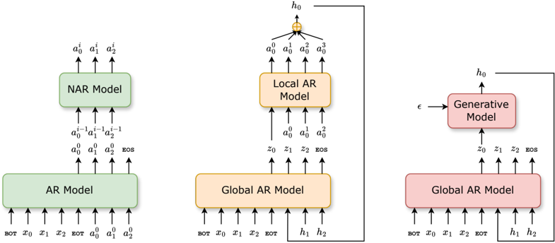
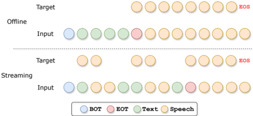

> [!abstract] NeurIPS · 2025 · Conference
> **Ma et al.** (Institute of Computing Technology, CAS / WeChat AI, Tencent) · [→ Paper](https://openreview.net/forum?id=pDWwz9F7Zh) · Demo: ✓ · Code: ✓
>
> Introduces SLED, an autoregressive speech language model that operates in continuous latent space and trains its per-step generative module with an energy-distance objective, avoiding both residual-vector-quantization discretization and the iterative sampling required by diffusion- or flow-matching-based continuous alternatives.

## Problem

Autoregressive speech language models typically discretize speech into tokens so each generation step can use a softmax-based categorical distribution, as in text LMs. But discretization introduces an information bottleneck, and residual vector quantization (RVQ), the standard way to mitigate that bottleneck while keeping bitrate low, produces multi-stream token sequences that require complicated hierarchical architectures (as in VALL-E's cascaded AR-then-NAR design or RQ-Transformer-style nested models) to generate. Modeling speech in a continuous latent space avoids both the discretization loss and the hierarchical-architecture requirement, but raises a different question: what should the per-step conditional generative module be? It needs to be expressive enough to capture a continuous distribution, but existing options are unsatisfying: diffusion-loss or flow-matching-based modules (as in MELLE, FELLE) require multiple iterative sampling steps per autoregressive step, and plain regression losses fail to capture the true distributional shape at all.

## Method

SLED encodes speech into continuous latent vectors (summing the embeddings across EnCodec's 8 residual codebooks per frame, rather than keeping them as separate discrete streams) and models these vectors autoregressively with a decoder-only LLaMA-style Transformer. At each step, a lightweight per-step generative module, a small MLP using AdaLN to inject noise into the autoregressive network's output features, implicitly defines the conditional distribution over the next continuous vector: sampling means drawing noise and passing it through the module once, with no iterative refinement. To train this implicit module jointly with the autoregressive backbone, the paper uses energy distance, a special case of maximum mean discrepancy that, for an appropriately chosen distance function, is a strictly proper scoring rule between the model's implicit distribution and the true data distribution. The resulting training loss closely resembles root-mean-squared error but includes an additional repulsive term between two independently sampled model outputs; this term is what distinguishes a genuine distributional objective from a plain regression loss, and the paper shows it is essential rather than incidental. Since continuous-latent modeling has no natural end-of-sequence token, a binary stop-classification head is trained alongside the main objective. Classifier-free guidance is applied at inference (masking the text prompt on a second forward pass and interpolating) to sharpen text-speech alignment. Because SLED requires no post-hoc non-autoregressive refinement stage, it naturally supports streaming synthesis: text and speech positions are interleaved at a fixed ratio during training and inference, so speech generation can begin before the full input text has arrived.

## Key Results

On zero-shot TTS (LibriSpeech-PC test-clean), SLED achieves a lower WER than the ground-truth recordings themselves (1.59/1.51 vs. 1.78 depending on prompting setting) and outperforms VALL-E on every reported metric in both prompting settings, despite VALL-E requiring an additional ~159M-parameter non-autoregressive module for residual-token prediction while SLED's per-step module is only ~35M parameters; both models share the same EnCodec latent encoder, isolating the comparison to the discrete-vs-continuous modeling choice. Against other continuous-latent approaches (MELLE, FELLE, CLaM-TTS), SLED achieves comparable or better quality while avoiding MELLE's need for a non-autoregressive refinement network and FELLE's need for multi-step ODE integration per decoding step. An ablation removing the energy-distance objective's repulsive term (making it equivalent to RMSE) causes catastrophic failure, WER-C rising from 1.59 to 40.6, with most generated samples failing to produce intelligible speech at all. Streaming inference (interleaving text and speech generation) achieves DNSMOS quality within 0.04 of offline generation while WER rises moderately (1.67 to 2.18-2.20). Against DiTAR, a semi-autoregressive continuous approach using a local diffusion transformer per step, SLED achieves comparable real-time factor while using roughly 10x fewer FLOPs and about one-third the parameters.

## Novelty Assessment

The application of energy distance, an established statistical tool for training implicit generative models via maximum mean discrepancy, to autoregressive speech language modeling specifically is the paper's central and genuinely novel contribution: it directly targets the requirement the authors identify (a per-step module that is expressive, sampling-efficient in a single pass, and trainable end-to-end with the autoregressive backbone) in a way prior continuous-latent approaches did not simultaneously satisfy. The paper's own analysis connecting MELLE's heuristic "flux loss" to an implicit approximation of the same repulsive term that makes energy distance a proper scoring rule is a notable piece of retrospective theoretical clarification, explaining why a seemingly ad hoc prior design choice worked.

## Field Significance

high — SLED offers a theoretically grounded, empirically validated simplification of continuous-latent autoregressive speech modeling: a single training objective replaces the need for either RVQ's hierarchical architecture or diffusion/flow-matching's iterative per-step sampling, while matching or exceeding the quality of both families of alternatives at comparable or better parameter and compute efficiency. The demonstrated support for genuine streaming synthesis (not just offline generation) with minimal quality loss extends its practical relevance to real-time spoken-interaction pipelines, which the authors explicitly identify as a direction for future general-purpose speech language models.

## Claims

- **supports:** Training a per-step continuous generative module with a strictly proper scoring rule like energy distance, rather than a plain regression loss, is necessary to make autoregressive continuous-latent speech modeling actually capture the target distribution rather than collapsing.
  > *Evidence:* Removing the repulsive term that distinguishes energy distance from RMSE causes catastrophic failure, WER-C degrading from 1.59 to 40.6, with the model failing to generate intelligible speech in most cases. *(§6.1, Table 3)*
- **supports:** Autoregressive speech language modeling in a continuous latent space with a single-forward-pass generative module can match or exceed the zero-shot TTS quality of discrete, RVQ-based autoregressive speech LMs while using a much smaller and simpler per-step module.
  > *Evidence:* SLED outperforms VALL-E on all reported metrics in both prompting settings despite using a roughly 35M-parameter per-step generative module compared to VALL-E's approximately 159M-parameter non-autoregressive residual-token predictor, with both models sharing the same EnCodec latent encoder. *(§5.4, Table 1)*
- **supports:** A continuous-latent speech language model whose per-step distribution is captured by a single forward pass, rather than an iterative diffusion or flow-matching process, can achieve comparable zero-shot synthesis quality to those iterative approaches while being substantially more computationally efficient.
  > *Evidence:* Compared to DiTAR, a semi-autoregressive continuous approach using a local diffusion transformer per step, SLED achieves a comparable real-time factor while using roughly 10x fewer FLOPs and about one-third the parameters. *(§6.3, Table 4)*
- **supports:** A purely autoregressive continuous-latent speech language model with no post-hoc non-autoregressive refinement stage can support genuine incremental streaming synthesis by interleaving text and speech generation, at a moderate cost to word accuracy relative to offline generation.
  > *Evidence:* With text and speech interleaved at a 5:20 or 5:45 token ratio, streaming inference achieves DNSMOS within 0.04 of offline generation (3.59/3.54 vs. 3.58) while WER rises from 1.67 to 2.18-2.20. *(§5.4, Table 2)*
- **complicates:** Classifier-free guidance strength in continuous-latent autoregressive speech generation trades off differently against intelligibility versus perceptual quality and speaker similarity, so a single guidance value cannot simultaneously optimize both.
  > *Evidence:* Increasing CFG strength from the unconditional setting sharply improves word accuracy up to a point, but timbre cloning and perceived speech quality peak at a moderate value and degrade with further increases, with streaming-mode quality at high guidance falling below even the no-CFG baseline. *(§6.2, Figure 3)*

## Limitations and Open Questions

The authors note that current speech language modeling approaches, including SLED, still show a meaningful gap in voice cloning quality compared to traditional (non-language-model) TTS systems at similar parameter scale, though they point to concurrent work (Llasa) showing that scaling discrete autoregressive speech models substantially closes this gap, motivating future scaling studies for continuous approaches. The latent encoder used (EnCodec) was originally designed for audio-codec reconstruction rather than for continuous-latent language modeling specifically; the authors suggest a purpose-trained continuous latent encoder could further improve results. The paper validates SLED only on speech synthesis rather than the broader general-purpose speech language modeling applications (e.g., speech understanding tasks) it argues the approach could extend to.

## Wiki Connections

- [[autoregressive-codec-tts|Autoregressive Codec TTS]] — replaces discrete RVQ token modeling with autoregressive generation over continuous codec-derived latent vectors, trained via an energy-distance objective instead of cross-entropy.
- [[zero-shot-tts|Zero-Shot TTS]] — evaluates zero-shot speech continuation and reference-speaker cloning, outperforming VALL-E and matching or exceeding other continuous-latent baselines.
- [[streaming-tts|Streaming TTS]] — supports incremental synthesis by interleaving text and speech generation at a fixed ratio, requiring no post-hoc refinement stage.
- [[2301.02111|VALL-E]] — used as the primary discrete-autoregressive baseline for isolating the effect of continuous vs. discrete modeling, since both share the same EnCodec latent encoder.
- [[2502.11128|FELLE]] — a continuous-latent baseline using per-step flow matching, discussed as requiring multi-step ODE integration that SLED's single-forward-pass module avoids.
- [[2502.03930|DiTAR]] — a semi-autoregressive continuous approach compared directly on decoding efficiency (RTF, FLOPs, parameter count).
- [[2025.acl-long.313|F5-TTS]] — used as a traditional (non-language-model) TTS baseline in the zero-shot synthesis comparison.
