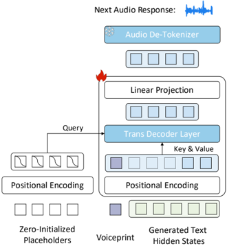

> [!abstract] NeurIPS · 2025 · Conference
> **Luo et al.** (KAUST / University of Exeter) · [→ Paper](https://openreview.net/forum?id=vhPy3NMsO5) · Demo: ✓ · Code: ✓
>
> Introduces Online Multimodal Conversational Response Generation (a task requiring simultaneous, incremental generation of a listener's speech, facial reactions, and text), OmniResponse (a multimodal LLM that solves it using text as a timestamped intermediate modality), and a controllable online TTS module, TempoVoice, that synchronizes generated speech with generated facial responses.

## Problem

Face-to-face conversation is multimodal on both sides: speakers convey meaning through speech and facial expression, and listeners respond with both verbal feedback (affirmations, brief interjections) and non-verbal cues (nods, expressions). Prior work has modeled these pieces separately, text dialogue systems ignore audio-visual behavior, facial-reaction-generation systems ignore verbal responses, and spoken dialogue systems (Moshi, dGSLM) handle audio and text but ignore vision, and mostly operate offline (waiting for a full input before responding). No prior system attempts online, synchronized generation of a listener's speech, facial reaction, and text response together, incrementally, as the speaker's input arrives. The core technical obstacle is synchronization: aligning generated audio with generated facial motion is already hard when the full audio signal is known in advance, and becomes substantially harder when both must be generated incrementally and jointly.

## Method

OmniResponse frames this as a two-stage problem connected by text as an intermediate modality: (1) a multimodal LLM (built on Phi-3.5-mini-instruct, fine-tuned via LoRA) jointly and autoregressively generates temporally-aligned facial reactions and textual response tokens from the speaker's incoming audio-visual-text stream, and (2) a dedicated synthesis module, TempoVoice, converts that generated text into speech synchronized with the facial output. Because raw text carries no temporal information, the paper introduces Chrono-Text Markup: two special tokens, `[PAUSE]` (silent intervals) and `[LASTING]` (a word continuing to be spoken), inserted into the token stream so that the text sequence has exactly the same length as the visual frame sequence, giving every text token an implicit timestamp without a separate timestamp-embedding mechanism. An omni-attention mechanism lets each modality's tokens attend causally to past tokens of any modality while keeping static context (instructions, conversation history) globally accessible.

TempoVoice takes the LLM's generated text hidden states, combines them with a fixed listener voiceprint embedding (extracted via the Spark-TTS global tokenizer), and applies sinusoidal positional encoding. Since audio, text, and visual-frame sequences all differ in native length, the module prepends zero-initialized, positionally-encoded placeholder tokens that serve as queries in a cross-attention module over the fused text-voice representations, letting a Transformer decoder generate discrete audio tokens (via the Spark-TTS audio tokenizer) autoregressively in lockstep with the visual stream rather than needing the audio and text/visual sequences to share a native length. The whole system is trained with a combined loss over text (next-token cross-entropy), vision (L2 reconstruction of facial features), and audio (next-token likelihood over discrete audio-codec tokens conditioned on the corresponding listener text hidden states).

## Key Results

To support this task, the paper introduces ResponseNet, a new dataset of 696 synchronized, split-screen dyadic conversation pairs (14.2 hours) with separated speaker/listener audio channels, word-level transcripts, and facial-behavior annotations, filling a gap in existing dyadic datasets which typically lack one of online streaming, separated audio, or text annotation. On ResponseNet, OmniResponse outperforms an LSTM baseline and an audio-visual LLM baseline (which lacks the text-intermediate design) across text quality (METEOR, BERTScore, ROUGE-L, Distinct-2), audio quality (UTMOSv2: 1.41 vs. 1.32 for the audio-visual LLM baseline), audio-visual synchronization (LSE-D: 9.56 vs. 10.03), and visual quality (FVD). Ablations isolate both novel components' contributions: removing Chrono-Text Markup degrades LSE-D from 9.56 to 11.51 and METEOR from 0.141 to 0.122; removing TempoVoice (replacing it with a direct MLP over trimmed/padded hidden states) degrades UTMOSv2 from 1.41 to 1.23 and LSE-D from 9.56 to 11.91. A 49-participant user study found direct A/B preference for OmniResponse over baselines on audio speech quality (77.6% vs. LSTM, 85.7% vs. Audio-Visual LLM) and audio-visual synchronization (91.8% vs. LSTM, 95.9% vs. Audio-Visual LLM).

## Novelty Assessment

From a speech-generation standpoint, the paper's main contribution relevant to this wiki is narrow but genuine: TempoVoice is a real, ablated mechanism for generating speech tokens synchronized to an independently-generated visual stream of different native length, using zero-initialized positional query tokens in cross-attention rather than requiring the audio and visual/text sequences to be pre-aligned in length. This is a useful, validated solution to a synchronization problem specific to joint audio-visual generation, though the paper's broader and more central contribution is the OMCRG task formulation and the ResponseNet dataset, which span facial and textual generation as much as (or more than) speech generation specifically.

## Field Significance

moderate — Within the scope of this wiki, TempoVoice contributes a concrete, ablated mechanism for temporally synchronizing generated speech with an independently generated modality (facial video) in an online, incremental setting, a real but narrowly-scoped architectural contribution. The paper's primary significance lies in the broader OMCRG task and ResponseNet dataset, which are valuable to multimodal dialogue research generally but only partially overlap with speech generation as this wiki's central focus.

## Claims

- **supports:** Using text as an explicit, timestamped intermediate modality between a multimodal LLM's language understanding and a downstream TTS module can improve both the content quality and audio-visual timing accuracy of synchronized, incrementally generated speech, compared to generating audio tokens directly from LLM hidden states.
  > *Evidence:* Removing TempoVoice (predicting audio tokens directly from trimmed/padded hidden states via an MLP) degrades UTMOSv2 from 1.41 to 1.23 and audio-visual synchronization (LSE-D) from 9.56 to 11.91. *(§5.3, Table 3)*
- **supports:** Explicit temporal markup embedded directly into generated text tokens, rather than post-hoc timestamp-window filtering of generated words, improves the semantic quality and audio-visual synchronization of speech generated from a static, non-temporal text representation.
  > *Evidence:* Removing Chrono-Text Markup (substituting timestamp-window filtering) degrades LSE-D from 9.56 to 11.51, METEOR from 0.141 to 0.122, and BERTScore F1 from 0.806 to 0.766. *(§5.3, Table 3)*
- **supports:** A cross-attention mechanism using zero-initialized, positionally-encoded placeholder queries over fused text-and-voiceprint representations can generate an audio-token sequence whose length is decoupled from the source text-token sequence, while remaining synchronized to a parallel, independently-generated visual stream.
  > *Evidence:* TempoVoice's decoder uses zero-initialized, sinusoidally-positioned placeholder tokens as cross-attention queries over fused text-voice representations, enabling autoregressive audio-token generation in lockstep with visual frames despite the differing native lengths of the audio, text, and visual-frame sequences. *(§3.1)*
- **complicates:** Multimodal listener-response systems that omit text as an explicit intermediate representation and instead generate audio directly from LLM hidden states struggle with both content quality and audio-visual timing, even when built on the same class of pretrained LLM.
  > *Evidence:* An Audio-visual LLM baseline lacking the text-intermediate design achieves substantially lower speech-content quality (METEOR 0.030 vs. 0.141, BERTScore F1 0.662 vs. 0.806) and worse audio-visual synchronization (LSE-D 10.03 vs. 9.56) than OmniResponse despite using a comparable pretrained LLM. *(§5.1, Table 2)*

## Limitations and Open Questions

The authors note the approach depends heavily on training data quality and diversity, requires accurate speaker-listener audio segmentation (degrading in noisy or overlapping conversations), and struggles with well-aligned multimodal response generation in fast-changing or emotionally rich interactions. ResponseNet itself is modest in scale (696 pairs, 14.2 hours) relative to large speech corpora, and the paper explicitly states it lacks a fairness analysis. The audio evaluation relies on an automated MOS predictor (UTMOSv2) and a Lip-Speech Error Distance metric rather than a dedicated human listening test isolating audio quality alone (the user study combines audio quality with visual and synchronization judgments).

## Wiki Connections

- [[streaming-tts|Streaming TTS]] — TempoVoice generates speech tokens online and incrementally, synchronized in real time with a parallel, independently-generated facial-video stream.
- [[spoken-language-model|Spoken Language Model]] — adapts a pretrained LLM to consume the speaker's real external audio-visual stream and generate synchronized spoken responses in a genuine dyadic dialogue setting.
- [[speech-to-speech|Speech-to-Speech]] — implements online, incremental listener response generation from a speaker's live audio-visual input, matching the end-to-end spoken dialogue paradigm.
- [[subjective-evaluation|Subjective Evaluation]] — reports a 49-participant A/B preference user study covering audio speech quality among other dimensions.
- [[2503.01710|Spark-TTS]] — its audio and global tokenizers are used directly within TempoVoice to represent speaker voiceprint and discrete speech tokens.
- [[2410.00037|Moshi]] — used as a real-time, audio-only spoken dialogue baseline in the evaluation comparison.
